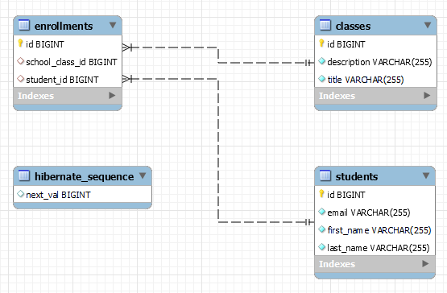

# Exercise - Spring Boot - Hibernate
* write a Spring Boot application that uses the following dependencies:
  * `Lombok`
  * `Spring Boot DevTools`
  * `Spring Web`
  * `Spring Data JPA` 
  * `MySQL Driver`
* use `hibernate` and `JPA` to connect to a local mysql database (e.g. `devdb`)
* the `ddl-auto` parameter has to be configured in a way that `hibernate` will create and then destroy the schema at the end of the session
* consider the following use case:
  * `1 student ---> n enrollments`
  * `1 class ---> n enrollments`
* using the right annotations and considering, write the code that will create:
  * the table `students` where each student has:
    * a primary key
    * a column `lastName` (not null)
    * a column `firstName` (not null)
    * a column `email` that is unique and not null
  * the table `classes` where each class has:
    * a primary key
    * a `title` (not null)
    * a `description` (not null)
  * the join table `enrollments` with:
    * a primary key
    * the 2 foreign keys
* so the final structure should be like the following pic:
  
